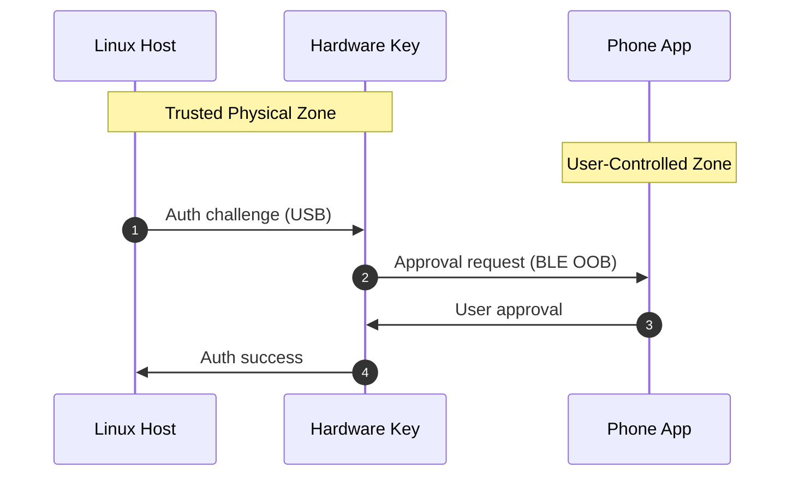

# roottap
Physical approval for privileged actions (sudo / SSH) via phone.

⚠️ Status: early prototype / active development. Not production-ready.

Roottap replaces reusable passwords for privileged Linux actions
(sudo / SSH) with a physical approval flow. Authentication requires
both a local hardware key and explicit user approval on a paired phone,
preventing silent privilege escalation even on compromised systems.

## Repo structure

```
roottap/
├── shared/        # protocol + crypto (future server-safe)
├── mobile/        # iOS / Android (native)
├── firmware/      # ESP32 (ESP-IDF)
├── host/          # Linux PAM + tooling (sudo target)
├── infra/         # CI, signing metadata
└── docs/          # architecture, threat model
```

## How it works

### Conceptual diagram


## Documentation

- [System setup](docs/setup/SETUP_ARCH.md)
- [Architecture overview](docs/architecture.md)
- [Protocol details](docs/protocol.md)
- [Threat model](docs/threat-model.md)
