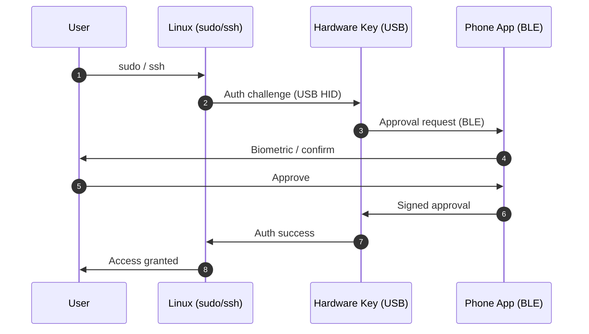

### Protocol details

```mermaid
sequenceDiagram
    autonumber
    participant U as User
    participant L as Linux (sudo/ssh)
    participant K as Hardware Key (USB)
    participant P as Phone App (BLE)

    U->>L: sudo / ssh
    L->>K: Auth challenge (USB HID)
    K->>P: Approval request (BLE)
    P->>U: Biometric / confirm
    U->>P: Approve
    P->>K: Signed approval
    K->>L: Auth success
    L->>U: Access granted
```